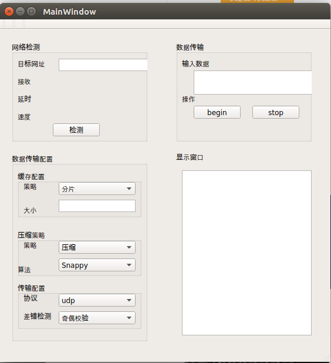
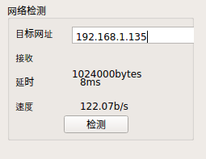
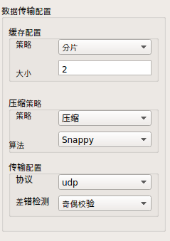
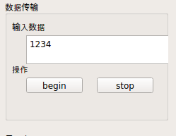
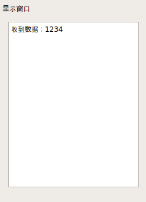
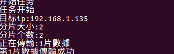
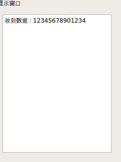
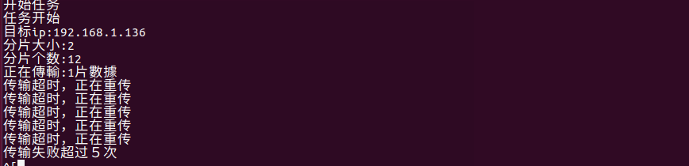

# UDP通信程序
    该程序支持超时重传和断点续传．运行程序后会出现如下图片，其中目标网址为另一个运行此程序所使用的ip．测试过程中可以在两台机器上分别运行该程序，目标ip填为对方的ip地址.

## 检测网络
    在目标网址输入框中输入目标ip，检测网速，在底下区域中实时显示网络状态．

## 数据传输配置

    分为三个配置分别是缓存配置，压缩配置，和传输配置．

### 缓存配置
    目前只有一种缓存配置，为分片传输，将原始数据分成大小相等的数据片缓存起来，依次传输，数据片大小可以在大小栏中设置
### 压缩配置
    压缩策略分为压缩和不进行压缩，压缩算法有snappy和gzip两种．
### 传输配置
    差错校验算法有奇偶校验和CRC校验两种．

## 数据传输
    此处可以填写传输的数据，控制传输任务的开始和结束．

## 显示信息
    此处显示信息．

## 操作步骤
　  输入目标ip，分片大小，和传输数据，然后点击begin按钮，此时控制台情况如下：

    然后程序按照分片顺序传输数据，结果如图．

    传输成功后另一端程序会显示传过来的数据：

    如果中间网络波动，出现丢包或者数据包数据被篡改的情况下，发送会重新发送数据，当发送超过5次的时候，任务自动停止，如下所示：
